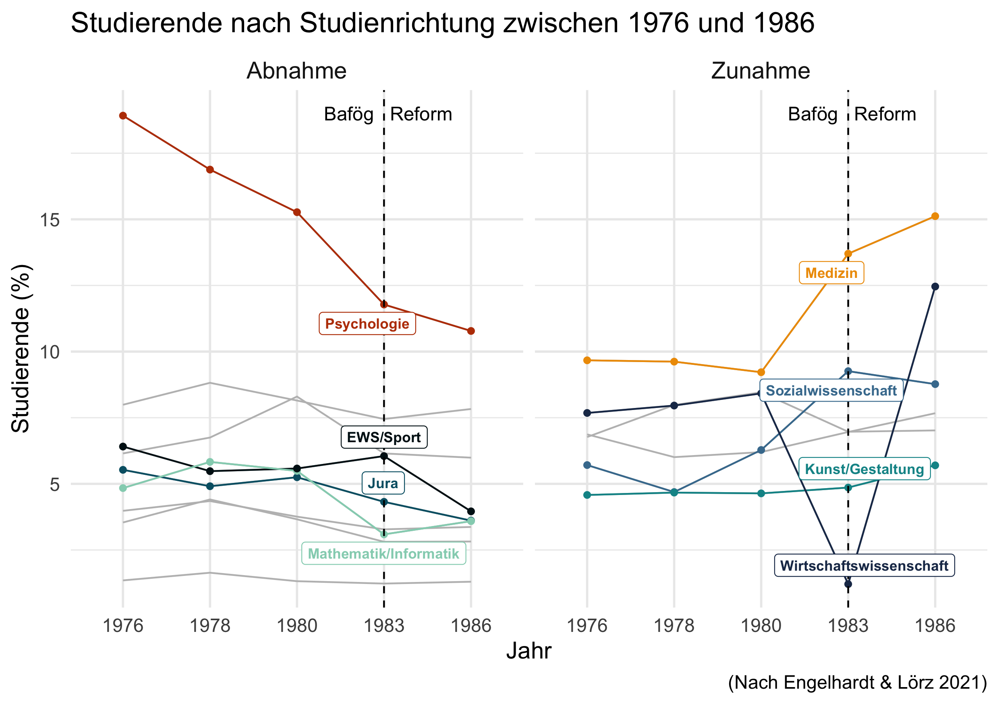
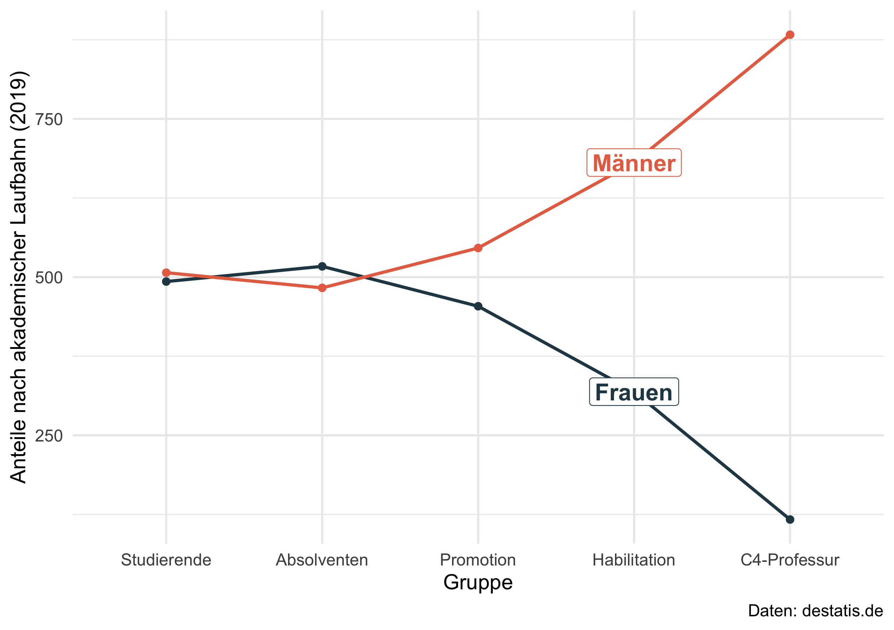

<!-- README.md is generated from README.Rmd. Please edit that file -->

```{r, include = FALSE}
knitr::opts_chunk$set(
  collapse = TRUE,
  comment = "#>",
  fig.path = "man/figures/",
  out.width = "100%"
)
```


# Visualize Research

<!-- badges: start -->

<!-- badges: end -->

We all tell our students that they should use graphs to visualizations key research findings. Every now and then I find a new study that I like to discuss with my students in class. Unfortunately, some researchers do not visualize their research findings (and core messages) which makes it harder to communicate that content to a broader audience that did not read the study. For this reason, I started to create visualization of those studies and I use them for teaching. Feel free to use them or have a look at corresponding R code to generate similar plots.


## Engelhardt & Lörz (2021)

Engelhardt & Lörz (2021) diskutieren die Auswirkungen von Studienkosten
auf herkunftsspezifische Ungleichheiten. Sie vergleichen dabei wie sich
die Bafög Reform auf die Studienaufnahme und die Studienfachwahl
auswirkt.

Das folgende Liniendiagramm zeigt, wie sich die Anzahl an Studierenden
in ausgewählten Fächern jeweils vor und nach der Bafög Reform (1983)
entwickelt hat und visualisiert Tabelle 1 in Engelhardt & Lörz (2021).



[*Quellcode*](https://github.com/edgar-treischl/VisualizeResearch/blob/master/R/Engelhardt_L%C3%B6rz_2021.R)


*Publikation*: Engelhardt, C. & Lörz, M. (2021): Auswirkungen von Studienkosten auf herkunftsspezifische Ungleichheiten bei der Studienaufnahme und der Studienfachwahl, Köln Z Soziol, 73, S. 285–305. DOI: <https://doi.org/10.1007/s11577-021-00787-3>


## Leaky Pipeline

Die Leaky Pipeline zeigt, dass ein Löwenanteil der Studierenden in
Deutschland zwar weiblich ist, der Bildungserfolg von Frauen sich aber nicht in der
akademischen Karriere niederschlägt. Vielmehr gehen die Anteile von
Männer und Frauen im Zeitverlauf der akademischen Karriere auseinander.



[*Quellcode*](https://github.com/edgar-treischl/VisualizeResearch/blob/master/R/Leaky_Pipeline.R)

*Beispielpublikation*: Schubert, F. & Engelange, S. (2011): Wie undicht ist die Pipeline? Wissenschaftskarrieren von promovierten Frauen, Kölner Zeitschrift für Soziologie und Sozialpsychologie, 63 (431).
