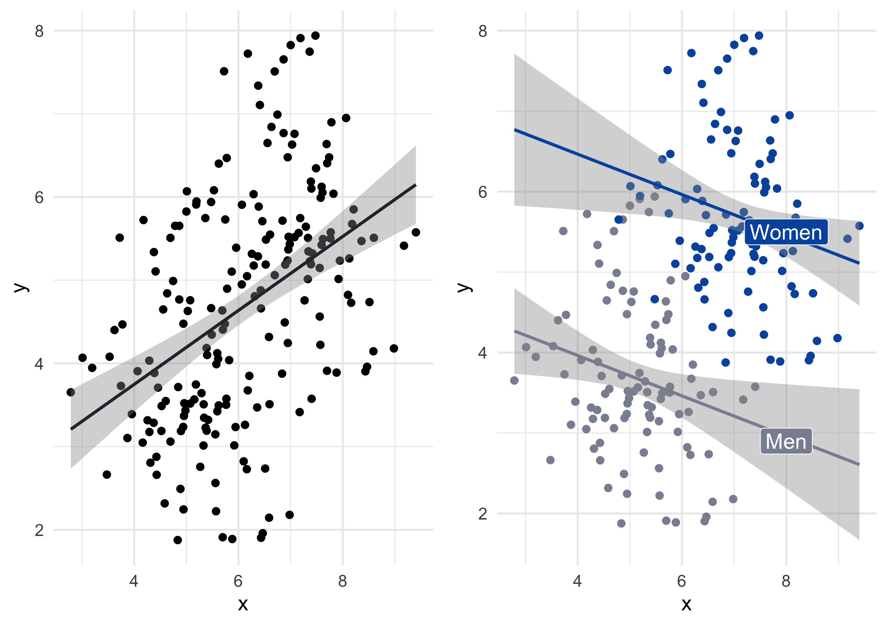
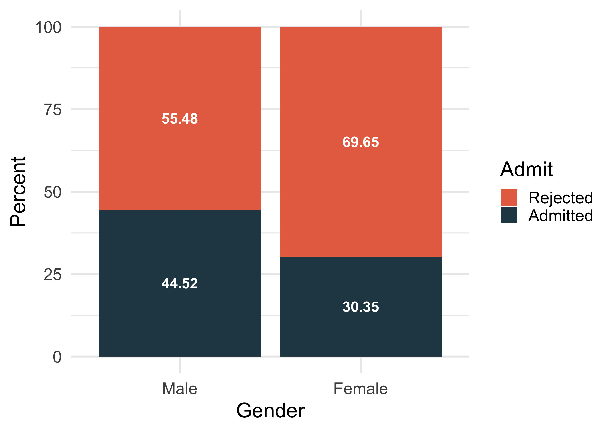
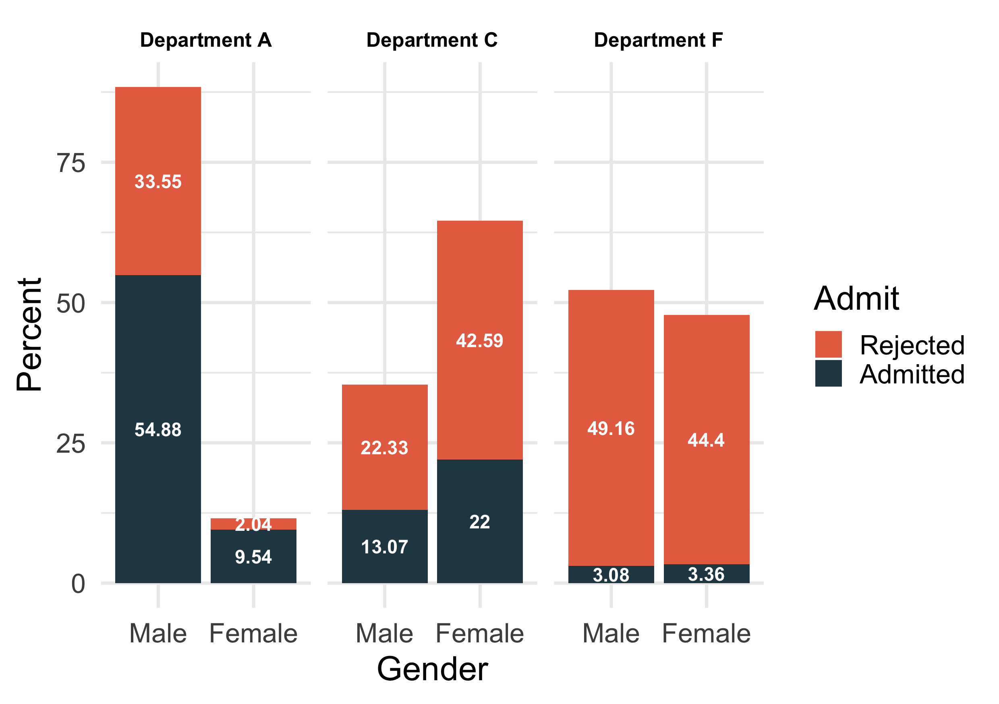
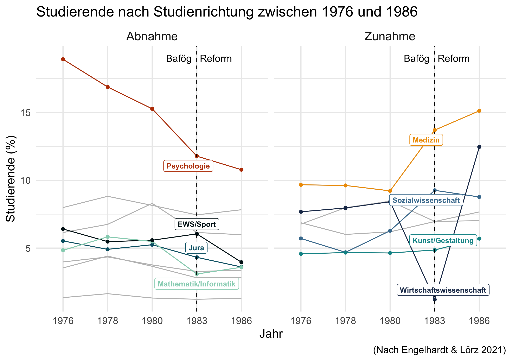
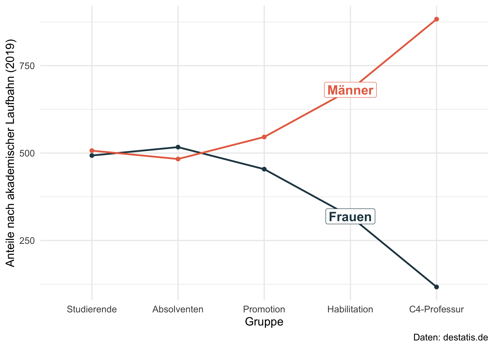

<!-- README.md is generated from README.Rmd. Please edit that file -->

# Visualize Research

<!-- badges: start -->
<!-- badges: end -->

We teach students to use visualizations to display research findings.
Unfortunately, I encounter each semester a new study that I like to
discuss with my students in class. However, some researchers do not
visualize their research which makes it harder to communicate their
findings to a broader audience such as an entire class. For this reason,
I started to provide some visualizations for my students in class. Feel
free to reuse them or use the corresponding R code to generate similar
plots.

## Simpsons pardox

Simpson’s paradox is a phenomenon in statistics in which a trend appears
in several groups of data but disappears or reverses when the groups are
combined. For instance, X and Y seem to be positively related, but
reverses if we compare of participants sex.

Another prominent example comes from UCB Admissions rates. It seems that
less women than men are rejected on the aggregate level.

 However, the effect
disappears if we stratify the data and compare admission rate for
different departments. In some departments more men are rejected and we
even find departments where approximately the same share of men or women
get rejected.

[*Sourcecode*](https://github.com/edgar-treischl/VisualizeResearch/blob/master/R/Simpsons_Paradox.R)

## Engelhardt & Lörz (2021)

Engelhardt & Lörz (2021) diskutieren die Auswirkungen von Studienkosten
auf herkunftsspezifische Ungleichheiten und vergleichen dabei wie sich
die Bafög Reform auf die Studienaufnahme und der Studienfachwahl
auswirkt.

Das folgende Liniendiagramm zeigt, wie sich die Anzahl an Studierenden
in ausgewählten Fächern jeweils vor und nach der Bafög Reform (1983)
entwickelt hat und visualisiert Tabelle 1 in Engelhardt & Lörz (2021).

[*Quellcode*](https://github.com/edgar-treischl/VisualizeResearch/blob/master/R/Engelhardt_L%C3%B6rz_2021.R)

*Publikation*: Engelhardt, C. & Lörz, M. (2021): Auswirkungen von
Studienkosten auf herkunftsspezifische Ungleichheiten bei der
Studienaufnahme und der Studienfachwahl, Köln Z Soziol, 73, S. 285–305.
DOI: <https://doi.org/10.1007/s11577-021-00787-3>

## Leaky Pipeline

Die Leaky Pipeline zeigt, dass ein Löwenanteil der Studierenden in
Deutschland zwar weiblich ist, der Bildungserfolg sich aber nicht in der
akademischen Karriere niederschlägt. Vielmehr gehen die Anteile von
Männer und Frauen auseinander.

[*Quellcode*](https://github.com/edgar-treischl/VisualizeResearch/blob/master/R/Leaky_Pipeline.R)

*Beispielpublikation*: Schubert, F. & Engelange, S. (2011): Wie undicht
ist die Pipeline? Wissenschaftskarrieren von promovierten Frauen, Kölner
Zeitschrift für Soziologie und Sozialpsychologie, 63 (431).
